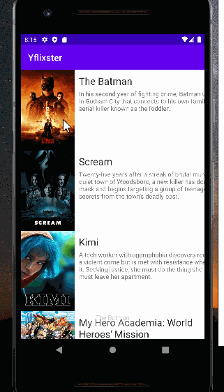

# yueflixter
codepathA1

**Name of your app** is an android app that allows building a todo list and basic todo items management functionality including adding new items, editing and deleting an existing item.

Submitted by: **Yue Zeng**

Time spent: **4** hours spent in total

## User Stories

The following **required** functionality is completed:

* [x] Expose details of movie (ratings using RatingBar, popularity, and synopsis) in a separate activity.
* [x] Allow video posts to be played in full-screen using the YouTubePlayerView 

## Video Walkthrough

Here's a walkthrough of implemented user stories:

## Notes

Describe any challenges encountered while building the app.

## License

    Copyright [Yue Zeng] [name of copyright owner]

    Licensed under the Apache License, Version 2.0 (the "License");
    you may not use this file except in compliance with the License.
    You may obtain a copy of the License at

        http://www.apache.org/licenses/LICENSE-2.0

    Unless required by applicable law or agreed to in writing, software
    distributed under the License is distributed on an "AS IS" BASIS,
    WITHOUT WARRANTIES OR CONDITIONS OF ANY KIND, either express or implied.
    See the License for the specific language governing permissions and
    limitations under the License.
